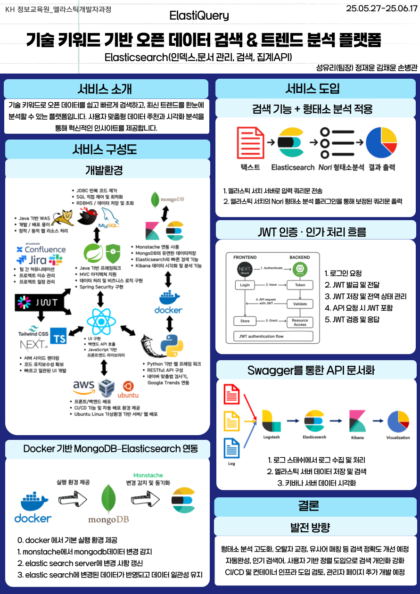
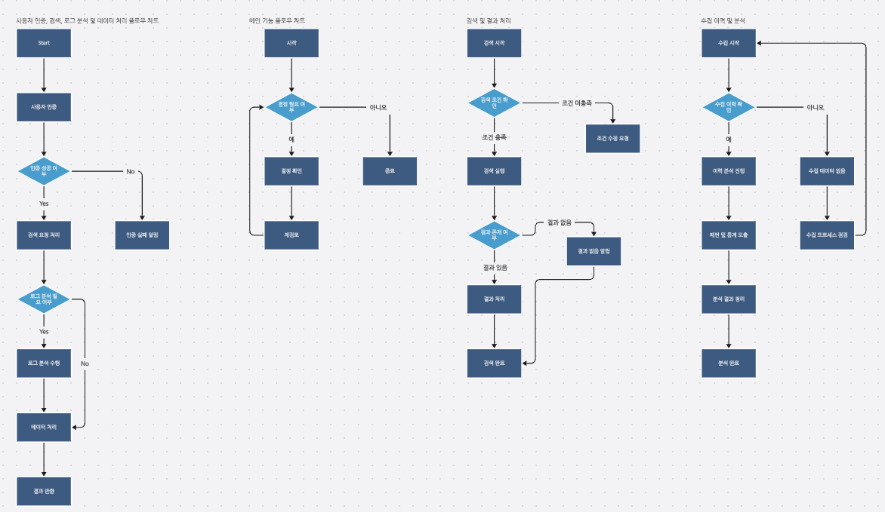
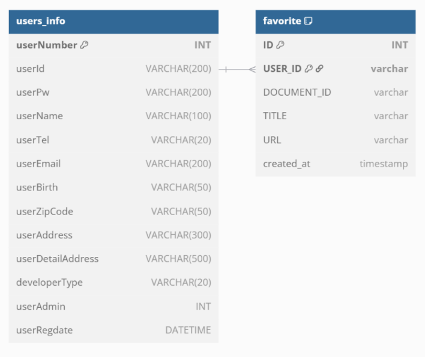
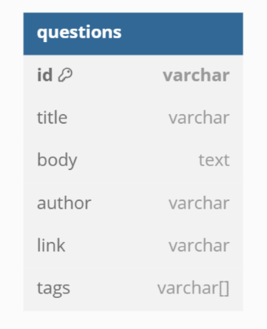
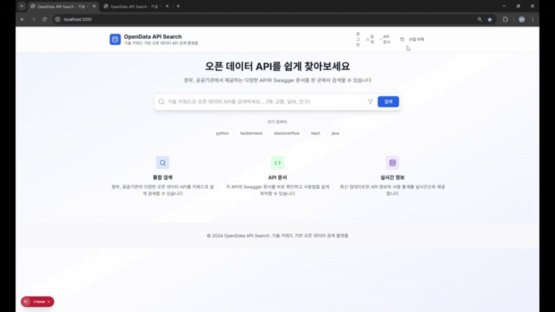
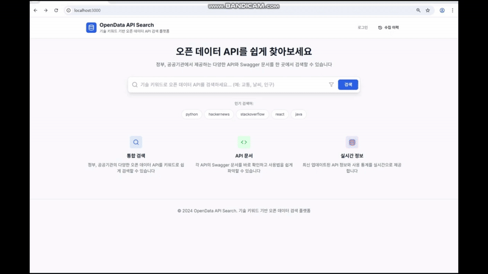
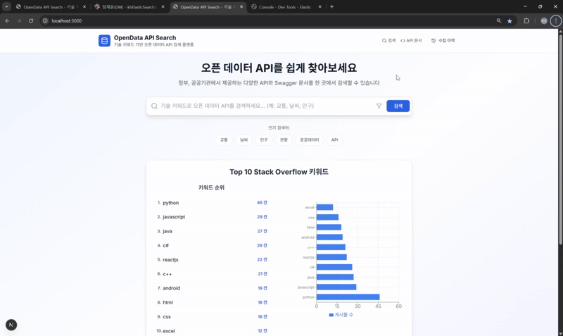
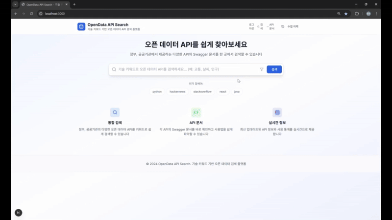

# 🚀 ElasticSearch_pj5

> **기술 키워드 기반 오픈 데이터 검색 & 트렌드 분석 플랫폼**  
> MongoDB ↔ Monstache ↔ Elasticsearch 연동을 통해 **형태소 분석 기반 검색 시스템**을 구축했습니다.  
> JWT 인증, Swagger 문서화, CSV/Excel 다운로드 및 변환환 등 실무 기술을 적용했습니다.
> Elasticsearch(인덱스,문서 관리, 검색, 집계API)

---
## 📅 프로젝트 개요

- **진행 기간**: 2025.05.27 ~ 2025.06.17
- **인원 구성**: 4인 팀 프로젝트

---

### 📌 프로젝트 개발 목표

- **형태소 분석 고도화된 검색 시스템** 한국어/영어 Nori 기반, 오타·유사도·맞춤법 반영 검색 
- **실시간 데이터 동기화·트렌드 분석** MongoDB-Monstache-Elasticsearch 연동, 외부 커뮤니티 데이터 분석 
- **안전한 인증 및 데이터 활용 환경** Spring Security/JWT, Swagger, CSV/Excel 다운로드
- **효율적 협업, 최신 기술 적용** Docker, GitHub Flow, Jira, Slack, 최신 프런트엔드 기술 도입
- **사용자 중심 UI/UX·서비스 확장성** 반응형 디자인, 즐겨찾기·마이페이지 등 맞춤 기능 강화

---

### 📌 개발 방향 요약
- 신뢰성 높은 오픈 데이터 검색·분석 플랫폼 구축
- 실무와 연결된 협업 경험 및 최신 기술 내재화
- 다양한 사용자 배경에 맞춘 데이터 활용성·확장성 강화

---

이러한 목표를 바탕으로 팀은 기술적 완성도뿐 아니라 실용성과 협업 역량까지 두루 갖춘 플랫폼 개발을 성공적으로 진행하고 있습니다.

---

## 🛠️ 기술 스택 하이라이트

- **Backend**: Spring Boot, MyBatis, JWT 기반 인증
- **Frontend**: React, Tailwind CSS, Zustand 등  
  

    
<strong>🎨 Frontend 상세 스택 보기</strong>

    - **Framework**: Next.js, React, TypeScript  
    - **Styling**: Tailwind CSS, Radix UI  
    - **폼 관리**: react-hook-form (Zod는 설치만)  
    - **상태 관리**: Zustand  
    - **라우팅**: Next.js App Router + 일부 react-router-dom  
    - **API 통신**: Axios, Fetch API  
  

- **Infra**: Docker, MongoDB, Monstache 연동, Elasticsearch
- **기타**: Swagger API 문서화, GitHub Flow 브랜치 관리 전략, Sourcetree 협업

  
🔑 <strong>주요 기술 및 특화 요소 (클릭해서 보기)</strong>

- **형태소 분석(Nori)**: 한국어/영어 최적화 Elasticsearch 형태소 분석기로 검색 정확도 향상
- **Monstache 연동**: MongoDB 데이터의 실시간 Elasticsearch 동기화
- **Bool 쿼리 검색**: 오타 및 유사도 반영 고급 검색 구현
- **네이버 맞춤법 검사기**: 한글 오타 보정으로 검색 품질 향상
- **JWT 기반 Spring Security**: 보안성 높은 인증 시스템 구축
- **config.toml 설정**: Monstache 네임스페이스와 인덱스 매핑 관리
- **React 키워드별 검색 & 페이지네이션**: 사용자 친화적 UI, 데이터 페이징 처리
- **인프라**: AWS EC2 배포 시도, Ubuntu+VirtualBox 환경 프론트 배포 완료
- **상태 관리**: Zustand 도입으로 효율적 상태 관리 구현

---

## ⚙️ 환경 및 구성

<table>
  <tr>
    <th>항목</th>
    <th>상세 내용</th>
  </tr>
  <tr>
    <td>운영체제</td>
    <td>
      
      
    </td>
  </tr>
  <tr>
    <td>사용언어</td>
    <td>
      
      
      
      
      
      
    </td>
  </tr>
  <tr>
    <td>개발 언어</td>
    <td>
      
    </td>
  </tr>
  <tr>
    <td>프레임워크</td>
    <td>
      
      
      
    </td>
  </tr>
  <tr>
    <td>ORM</td>
    <td>
      
    </td>
  </tr>
  <tr>
    <td>데이터베이스</td>
    <td>
      
      
      
    </td>
  </tr>
  <tr>
    <td>빌드 도구</td>
    <td>
      
    </td>
  </tr>
  <tr>
    <td>WAS</td>
    <td>
      
      
    </td>
  </tr>
  <tr>
    <td>형상 관리</td>
    <td>
      
    </td>
  </tr>
  <tr>
    <td>협업 도구</td>
    <td>
      
      
      
      
    </td>
  </tr>
  <tr>
    <td>API 테스트</td>
    <td>
      
    </td>
  </tr>
</table>

---

## 🖥️ 기술 스택 상세

### 🌐 프론트엔드

| 기술 | 설명 |
|---|---|
|  | 서버 사이드 렌더링 기반 동적 HTML 생성 |
|   | 클라이언트 상호작용 구현 및 Ajax 요청 처리 |
|  | 반응형 UI 디자인 구현 |
|  | View와 DB 간의 데이터 매핑 처리 (JSP ↔ DAO) |
|    | SPA/SSR 기반 프론트엔드 프레임워크, 타입 안정성 |
|   | 유틸리티 퍼스트 CSS, UI 컴포넌트 |
|  | 글로벌 상태 관리 |
|  | 폼 상태 관리 |
|   | REST API 통신 |

---

### ⚙️ 백엔드

| 기술 | 설명 |
|---|---|
|  | RESTful API 구현, 설정 자동화, 내장 톰캣 기반 서버 환경 |
|  | 계층화된 컨트롤러-서비스 구조로 웹 애플리케이션 구현 |
|  | SQL 중심 ORM, DB 연동 및 동적 쿼리 처리 |
|  | 사용자 인증/인가 및 세션 관리 구현 |
|  | 토큰 기반 인증 구조, 무상태 인증 처리 방식 적용 |
|  | Python 기반 API 서버 |

---

## 🔌 외부 연동 API

| API | 설명 |
|---|---|
|  | API 명세 및 테스트 제공 |
|  | 이메일 인증 시스템 구현 |
|  | 회원가입 주소 자동입력 |
|    | 소셜 로그인 연동 |
|     | 외부 데이터/번역 API 활용 |

---

## 🛠️ 개발 도구

| 도구 | 역할 |
|---|---|
|   | Java 백엔드 및 Spring Boot 개발 |
|  | Spring Boot 개발 |
|  | Oracle DB 관리 |
|  | 프론트엔드, JSP 및 JS 개발 |
|  | API 테스트 및 디버깅 |
|  | 프로젝트 버전 관리 및 협업 |
|  | 기획/기록/문서화 |
|  | 업무 프로세스 관리, 일정 계획 |
|  | 컨테이너 기반 배포 |
|  | Git GUI 협업 툴 |

---

## 🤝 협업 툴 및 자동화

-  팀 소통 및 실시간 알림 채널
-  팀원별 문서 관리, 기능별 페이지 권한
-  스크럼 보드 업무 분배 및 상태 관리, 완료 알림 자동화
-   
  - Push 시 Slack 알림 연동  
  - GitHub Flow 전략 적용

  
<strong>🛠️ 협업 도구 상세 보기</strong>

| 도구 | 역할 및 기능 | 자동화 및 특징 |
|---|---|---|
| Slack | 실시간 커뮤니케이션 및 알림 | Jira, GitHub 이벤트 알림 자동 수신 |
| Confluence | 프로젝트 문서화, 핸드북 관리 | 팀원별 개인 페이지 제공 및 편집 권한 관리 |
| Jira | 업무 스크럼 보드 관리 | 완료 상태 시 Slack 알림 자동 전송 |
| GitHub | 코드 저장소 및 버전 관리 | Push 시 Slack 알림 |

---

## 🐞 주요 이슈 및 협업 관리

- 서버 메모리 이슈가 간헐적으로 발생했으나, 리소스 관리로 해결
- 병합 충돌 없이 Git Flow 전략과 Sourcetree로 안정적 브랜치 관리
- GitHub Actions CI/CD는 미사용, GitHub Flow 기반 브랜치 관리와 Sourcetree 협업

---

## 🧩 주요 기능

| 기능 | 설명 |
|---|---|
| 🔐 JWT 인증 | 사용자 로그인/인가 토큰 처리 |
| 🔄 Monstache 연동 | MongoDB → Elasticsearch 실시간 데이터 동기화 |
| 🔍 형태소 검색 | Elasticsearch + Nori 분석기로 자연어 검색 |
| 📊 Swagger | API 명세 및 테스트 제공 |
| ⬇️ CSV/Excel 다운로드 | API 응답 데이터 다운로드 기능 |

---

## 🎉 프로젝트 한눈에 보기

- **다양한 기술 조합**: Java, Python, JavaScript, TypeScript, HTML, CSS 등 다양한 언어와 프레임워크를 적극 활용
- **검색 품질과 사용자 경험**: 형태소 분석, 오타 교정, 실시간 데이터 동기화, 고급 검색 등으로 차별화된 검색 경험 제공
- **효율적 협업**: Slack, Jira, Confluence, GitHub, Sourcetree 등 협업 및 자동화 도구 적극 도입
- **클린 코드 & 자동화**: CI/CD, 코드 리뷰, 문서화 등 품질과 유지보수성을 고려한 개발 프로세스

---

📁 프로젝트 구조 및 설계

### 📌 업무 흐름도

### 🗂️ ERD

| ERD1 | ERD2 |
|-------|-------|
|  |  |

### 💻 화면 설계
- 검색창 + 필터 + 스택오버플로우 실시간 top 10
- 형태소 분석 검색 결과 리스트
- 로그인/회원가입
- 수집이력(마이페이지) 즐겨찾기 및 사용자별, 유저별 지표화

### 📝 테이블 명세 

---

📷 시연 영상 및 발표 요약

  
### 🎥 시연 영상  
📺 [👉 유튜브로 시연 영상 보러가기](https://youtu.be/QaNWE73Mm_g?si=qnytRfteBIAMXFIs)

### 🧾 발표 요약

## 로그인 수집이력 그래프 검색후  
 

## 로그인/회원가입/비밀번호찾기/소셜로그인  
 

## 버튼(api문서, 즐겨찾기, 사이트방문)  
 

## Stackoverflow top 10 지표화  
 

## 수집이력페이지 즐겨찾기  
 

## Ubuntu 서버 배포  
- 프론트엔드: Ubuntu 서버에 배포 완료  
- 백엔드: 추후 연동 예정 (작업 중)  
 

#### 📌 중간 발표 (2025.06.10)
- 실시간 검색의 필요성과 기술 구성 소개
- Docker 기반 연동 흐름 설명
- 형태소 검색 결과 시연

#### 🗓️ 주간 보고서
- 1주차: 기획, 기술 조사, 초기 세팅  
- 2주차: 기능 구현, API 연동, 테스트  
- 3주차: 기능구현, 테스트, 배포, 문서화, 발표 준비

---

📦 릴리즈 내역

### 🔖 [중간점검 릴리즈 (2025.06.10)](https://github.com/yuriuser126/ElasticSearch_pj5/releases/tag/v1.0-mid)

- 발표자료(PDF) 업로드  
- 주간보고서 2종 포함  
- 발표 대본 및 산출물 압축 파일 포함  
- 기능 목록 및 기술 스택 요약

### 🔖 [최종 발표 릴리즈 (2025.06.17)](https://github.com/yuriuser126/ElasticSearch_pj5/releases/tag/v1.0-final)

- 발표 자료(PDF, PPTX, ZIP) 업로드  
- 발표 대본(txt) 및 주간 보고서 이미지 포함  
- 발표 자료 전용 압축본 포함 (`ElastiQuery.zip`)  
- 기술 문서 및 API 문서 경로 안내 (`/docs` 폴더 참고)

---

📘 Confluence Collaboration

> 모든 팀원이 각자 맡은 역할에 따라 문서를 작성하고 실시간 피드백을 주고받으며 협업하였습니다.
> 아래는 팀원별 Confluence 문서 링크입니다. (PDF 내보내기 버전은 `/docs` 폴더에 포함)

- 👤 성유리 (PM) – [기획 및 일정 관리, 프론트엔드 UI/UX 흐름 설계, Elastic 검색기](./docs/confluence-pdf/confluence-yuri.pdf)  
- 👤 정재윤 – [백엔드 API 설계 및 동기화 구조, Elasticsearch 검색 및 형태소 분석 정리](./docs/confluence-pdf/confluence-jaeyoon.pdf)  
- 👤 김채윤 – [리액트 및 JWT 로그인, 서버 구축](./docs/confluence-pdf/confluence-chaeyoon.pdf)  
- 👤 손병관 – [Swagger 자동문서화, Tableau Public 시각화](./docs/confluence-pdf/confluence-byungkwan.pdf)  

---

🌿 브랜치 전략 및 개발 규칙

### 🔧 git flow 브랜치 전략

| 브랜치 | 역할 |
|--------|------|
| 🟢 `main` | 배포 전용, 직접 커밋 ❌ |
| 🟡 `develop` | 통합 개발 브랜치 |
| 🔵 `feature/*` | 기능별 개인 작업 브랜치 |

### 📎 커밋/작업 규칙
- `main` 브랜치로 직접 작업/PR 금지  
- 항상 최신 `develop` 기준으로 작업  
- 민감 정보(.env, 키 등) 절대 커밋 금지  
- 작업 중 `develop` 최신 pull → 충돌 최소화

### 💻 Sourcetree 기준 브랜치 체크아웃
1. Sourcetree 실행 후 저장소 열기  
2. 상단 **Fetch** 클릭 → 원격 브랜치 갱신  
3. **origin/브랜치명** 우클릭 → **Checkout**

---

📝 프로젝트 개인별 (GitHub 링크)

- 👤 [성유리(PM)](https://github.com/yuriuser126/ElasticSearch_pj5.git)) 
- 👤 [정재윤](https://github.com/tjrdl?tab=repositories) 
- 👤 [김채윤](https://github.com/Chaeyoon-k?tab=repositories) 
- 👤 [손병관](https://github.com/sonbg2025?tab=repositories) 

---

📁 첨부 자료 및 원문서

- 📄 [화면 설계서](./docs/UI-Design-Document/README.md)  
- 📄 [업무 분장표](./docs/Team_Task_Assignment_Phase5.pdf)
- 📄 [테이블 명세서](./docs/Table%20Schema.png)
- 📄 [발표 자료는 릴리즈 페이지에서 확인하세요](https://github.com/yuriuser126/ElasticSearch_pj5/releases)
- 📄 [프로그램 기술서 보러가기](./docs/tech-doc.md)
- `/docs` 폴더 내 포함됨

---

## 📝 License

This project is licensed under the terms of the **Apache License 2.0**.  
See the [LICENSE](./LICENSE) file for details.
